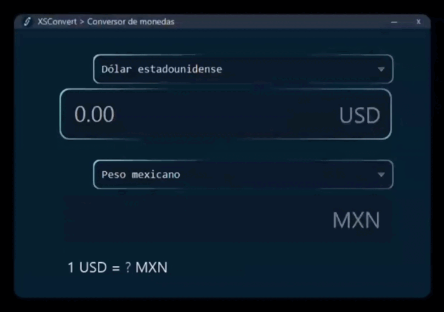
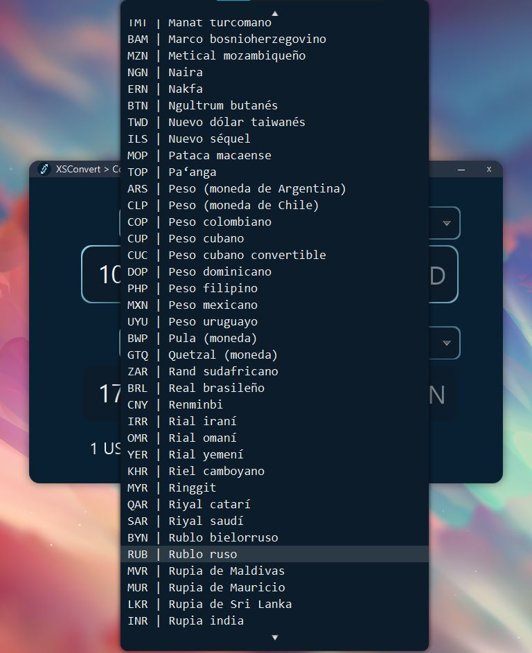

<!-- PROJECT LOGO -->
 

  <h1 align="center">XSConvert</h1>
   
    
   

<!-- ABOUT THE PROJECT -->
# Acerca del proyecto

### XSConvert es una aplicación para convertir monedas de manera rápida y sencilla, soportando la mayoría de divisas en el mundo.
Desarrollado con JavaFX

<!-- GETTING STARTED -->
# Uso de la aplicación

  
  ### XSConvert permite convertir una cantidad de cualquier divisa a otra.

  ### Selecciona la moneda base y la moneda de destino, ingresa la cantidad, y pulsa el botón "convertir", el resultado de la conversión se mostrará en la caja de texto inferior.

  ### Adicionalmente, se muestra la tasa de conversión entre las dos divisas una vez realizada la conversión.

  ### La aplicación utiliza la API de [Currency Converter](https://rapidapi.com/natkapral/api/currency-converter5).

  

<!-- CONTACT -->
# Contacto

Andrés Piñón - [@AndresPrza](https://twitter.com/AndresPrza) - andresprza@gmail.com

[![LinkedIn][linkedin-shield]][linkedin-url]

< <a href="#readme-top">Volver al inicio</a>

<!-- MARKDOWN LINKS & IMAGES -->
<!-- https://www.markdownguide.org/basic-syntax/#reference-style-links -->
[linkedin-shield]: https://img.shields.io/badge/-LinkedIn-black.svg?style=for-the-badge&logo=linkedin&colorB=555
[linkedin-url]: https://linkedin.com/in/andresprza
