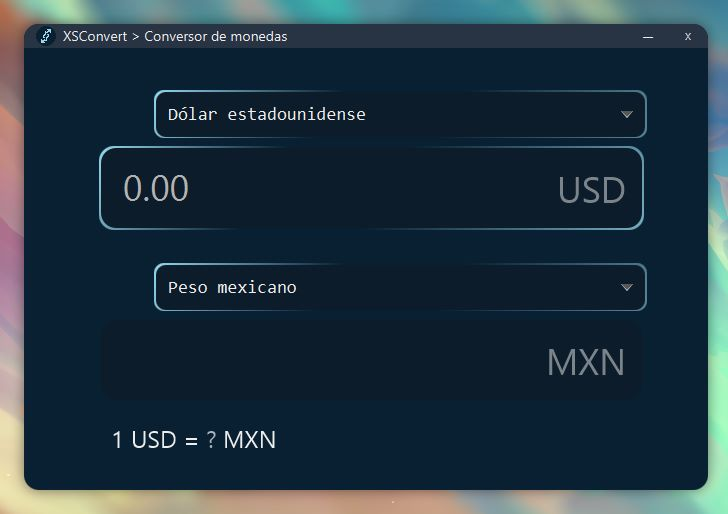
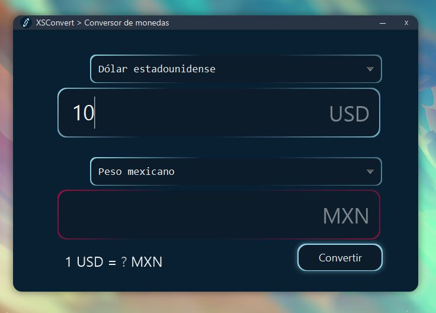
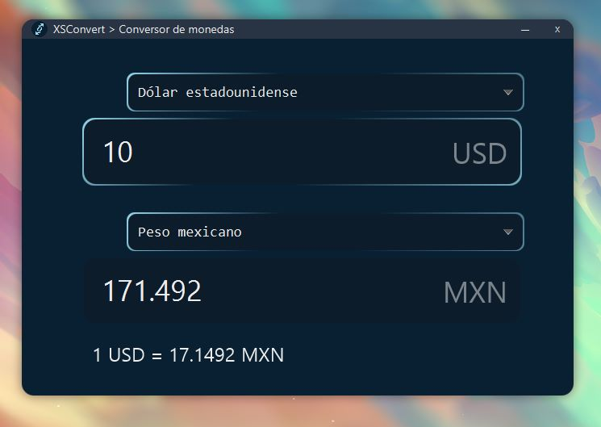
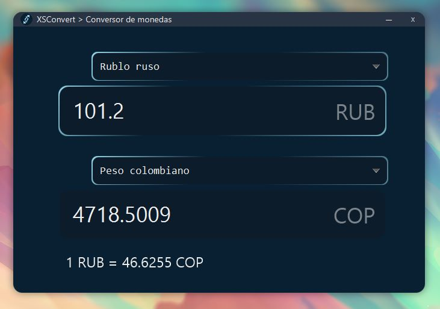

<!-- PROJECT LOGO -->
 

  

  <h3 align="center">XSConvert</h3>

<!-- ABOUT THE PROJECT -->
## Acerca del proyecto

[![Product Name Screen Shot][product-screenshot]](https://example.com)

XSConvert es una aplicación para convertir monedas de manera rápida y sencilla, soportando la mayoría de divisas en el mundo.

Desarrollado con JavaFX

<!-- GETTING STARTED -->
## Uso de la aplicación

  
  
  La aplicación cuenta con un campo de tecto para ingresar la cantidad de dinero a convertir, un campo para seleccionar la divisa base, y otro para seleccionar la divisa de destino.

  

  

  Ingresa un valor para convertir y pulsa el botón.

  

  Con la mayoría de monedas en el mundo disponibles.

  

  Obtén la tasa de conversión entre dos divisas.

<!-- CONTACT -->
## Contacto

Andrés Piñón - [@AndresPrza](https://twitter.com/AndresPrza) - andresprza@gmail.com

[![LinkedIn][linkedin-shield]][linkedin-url]

< <a href="#readme-top">Volver al inicio</a>

<!-- MARKDOWN LINKS & IMAGES -->
<!-- https://www.markdownguide.org/basic-syntax/#reference-style-links -->
[linkedin-shield]: https://img.shields.io/badge/-LinkedIn-black.svg?style=for-the-badge&logo=linkedin&colorB=555
[linkedin-url]: https://linkedin.com/in/andresprza
[product-screenshot]: product-img/main.jpg
